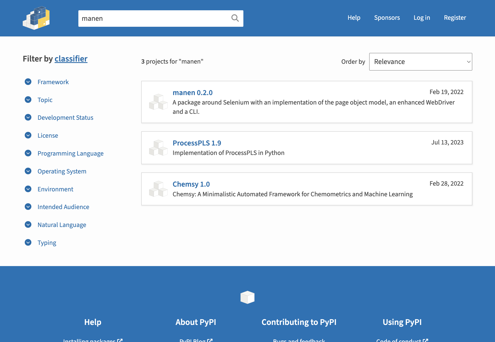

<p align="center">
  <h1 align="center"> 🌔  manen</h1>
</p>

----

<p align="center">
  
  
  
</p>

<p align="center">
  <i><b>A package around <a href="https://pypi.org/project/selenium/"><code>selenium</code></a> to easily construct Python objects which reflect the DOM of any webpages.</b></i>
  <i>Delivered with other features like an enhanced WebDriver and a resource manager.</i>
</p>

----

<p align="center">
  <a href="https://pypi.org/project/manen">PyPI package</a>
  ・
  <a href="https://kodaho.github.io/manen/">Documentation</a>
  ・
  <a href="https://github.com/kodaho/manen/issues">Issue tracking</a>
</p>

`manen` is a package built to extend Selenium user experience.
Among the core features, you can find:

- an implementation of the [page object model](https://www.selenium.dev/documentation/en/guidelines_and_recommendations/page_object_models/)
- a class which completes `selenium.webdriver.remote.webdriver.WebDriver`
- some helpers to manage resources usually required by Selenium
- a function to easily find and isolate DOM elements inside a page

This package will allow you to write more concise, flexible and powerful code compared to
what you could do by using only Selenium.

## 📥  Installation

The package can be installed using the official package manager `pip`.

```bash
pip install manen
```

It will install the package as well as the associated CLI.


## ✨ Features

- `manen.finder.find` allows to easily get element(s) in a HTML page. This function support
  several very different use cases, to help reduce your code complexity when fecthing for
  elements.
- `manen.resource` is a module to easily interact with all the assets needed by Selenium.
  It allows for example to download all the drivers required to interact with web browsers.
- `manen.browser` defined `Browser` objects, an enhanced Selenium's `WebDriver`.
- `manen.page_object_model` is the implementation of page object model described in Selenium
  documentation. Thanks to that, you can wrap a HTML page inside Python class and so provides
  readability and stability to your code.
- a CLI is shipped with the initial release in order to perform operations such as downloading
  driver executables.


## 🚀 Getting started

`manen` offers several features described in the [User Guide](https://kodaho.github.io/manen/user_guide.html)
of the documentation. We will give here a minimal example of what can be done with it; the goal will be to use
Selenium to explore the PyPI page of `manen` and extract some information from it.

The first step is to create an instance of a Selenium `WebDriver` or Manen `WebBrowser` that will be
used to browse the Internet.

```python
In [1]: from manen.browser import ChromeBrowser

In [2]: browser = ChromeBrowser.initialize(proxy=None, headless=True)

In [3]: browser.get("https://pypi.org")
```


We are now on the home page of PyPI. What we are going to do now is interact with the webpage
using a manen `Page`. It will essentially use the package
[`manen.page_object_model`](https://kodaho.github.io/manen/manen/manen.page_object_model.html), that
stores all the classes used to do the interface with each web element.

```python
In [4]: import manen.page_object_model as pom
   ...:
   ...:
   ...: class HomePage(pom.Page):
   ...:     query = pom.InputElement("input[id='search']")
   ...:
   ...:
   ...: class SearchResultPage(pom.Page):
   ...:     class ResultRegions(pom.Regions):
   ...:         name = pom.TextElement("h3 span.package-snippet__name")
   ...:         version = pom.TextElement("h3 span.package-snippet__version")
   ...:         link = pom.LinkElement("a.package-snippet")
   ...:         description = pom.TextElement("p.package-snippet__description")
   ...:
   ...:     n_results = pom.IntegerElement("//*[@id='content']//form/div[1]/div[1]/p/strong")
   ...:     results = ResultRegions("ul[aria-label='Search results'] li")
```

The `Page` class is used to modelize a whole WebDriver page; all elements defined inside the class
should modelize a given element on the page, identified with the selectors (XPath, CSS or else).
For example, the class `TextElement` will extract the text from a HTML element, `LinkElement` will
extract the `href` attribute from an `a` tag. A lot of different classes exist, all of them in charge
of a special extraction; they are defined and documented in the module
[`manen.page_object_model`](https://kodaho.github.io/manen/manen/manen.page_object_model.html).

The class `Region` is used to modelize a sub-part of a webpage. Each region can have its own inner
elements. You can have as many imbricated levels as wanted.

For example, the class `HomePage` defines an `InputElement` that do the link with the search bar.
To fill a value in this search bar, you can simply assign a value to the attribute `query` of
the instance of an `HomePage`, initialized with `browser` as argument.

```python
In [5]: page = HomePage(browser)

In [6]: page.query = "manen"

In [7]: from manen.page_object_model import Action

In [8]: page.query = Action("submit")
```

Submitting the form will refer to a page with the results of our query. Let's use the class
`SearchResultPage` to retrieve the results.



```python
In [9]: page = SearchResultPage(browser)

In [10]: page.n_results
Out[10]: 1

In [11]: page.results
Out[11]: [<__main__.SearchResultPage.ResultRegions at 0x1058e97c0>]

In [12]: print(
    ...:     f"Name: {page.results[0].name}",
    ...:     f"Description: {page.results[0].description[:80]}...",
    ...:     f"Version: {page.results[0].version}",
    ...:     f"Link: {page.results[0].link}",
    ...:     sep="\n",
    ...: )
Name: manen
Description: A package around `selenium` offering, among other features, an implementation of...
Version: 0.1.0
Link: https://pypi.org/project/manen/
```

Last step is to close the browser to avoid any remaining running application once we close Python.
```python
In [13]: browser.quit()
```


## 🦾 Going further

The best way to have full knowledge of the package is to read
[the documentation of the project](https://kodaho.github.io/manen/)!

If you want to have the exhaustive list of improvements of the package, check the
[Changelog](https://kodaho.github.io/manen/changelog.html) page.

Looking to contribute to fix or add new features? Just read
[this page](https://kodaho.github.io/manen/contributing.html),
fork the official repository and start doing the modifications you want.
